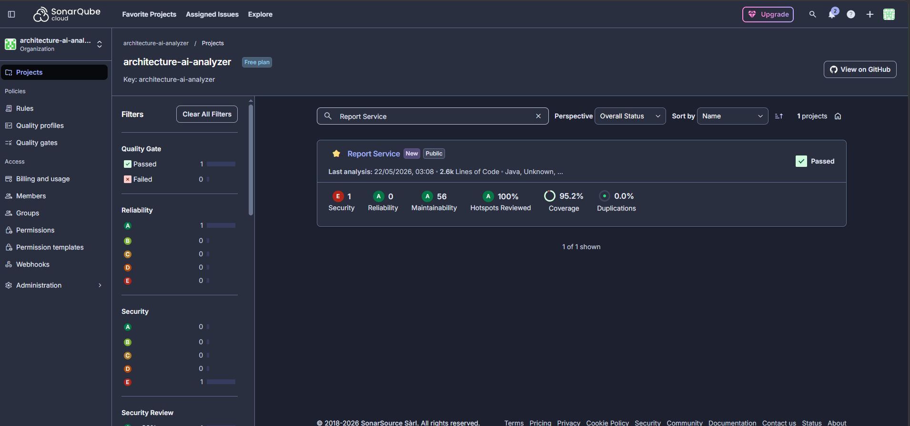
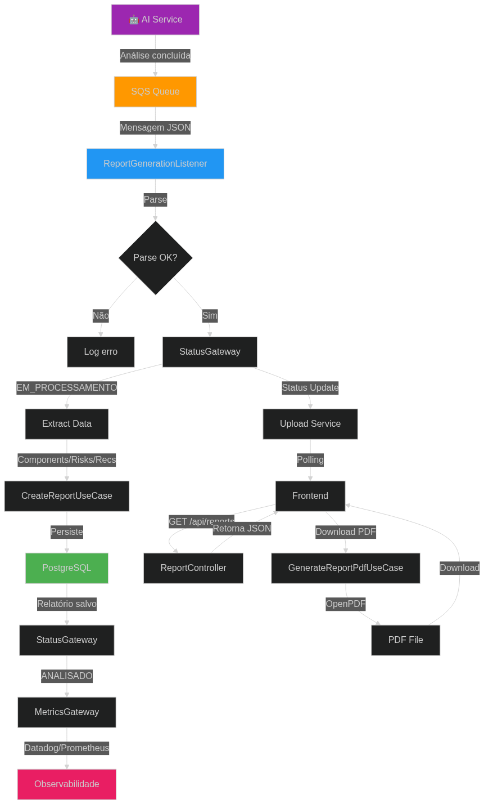
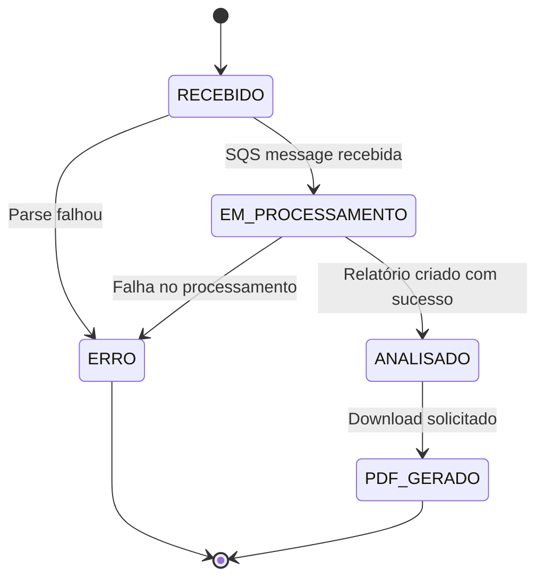

# Hackathon Services - Sistema de Relatórios de Análise de Arquitetura

## 📋 Descrição do Problema

O projeto **Hackathon Services - Report Service** aborda o desafio de **gerar, armazenar e disponibilizar relatórios técnicos de análise de arquitetura** a partir de diagramas processados por IA. Este serviço é responsável por consolidar resultados de análise (componentes, riscos, recomendações) e fornecer APIs para consulta e download.

### Desafios Principais

1. **Processamento assíncrono de resultados**: Receber resultados de análise de IA via fila SQS sem bloquear requisições
2. **Armazenamento estruturado**: Persistir relatórios com dados complexos (componentes, riscos, recomendações) em PostgreSQL usando JSONB
3. **Rastreamento de status**: Manter e expor status de processamento (Recebido, Em Processamento, Analisado, Erro)
4. **Geração de PDF**: Converter relatórios estruturados em documentos PDF para download
5. **Consulta eficiente**: Permitir busca por diagram ID, listagem paginada e filtragem de relatórios

### Premissas Arquiteturais

- **report-service** é responsável por: receber resultados de IA via SQS, processar e persistir relatórios, atualizar status, gerar PDFs, expor APIs de consulta
- **AI Service** é responsável por: analisar diagramas, extrair componentes/riscos/recomendações, publicar resultados na fila
- **Upload Service** é responsável por: receber uploads, orquestrar o fluxo, consultar status de processamento
- **Frontend** é responsável por: interface de usuário, polling de status, exibição de relatórios, download de PDFs

---

## 🏗️ Arquitetura Proposta

### Stack Tecnológico

#### Backend (report-service)

- **Framework**: Spring Boot 3.5.5 (Java 21)
- **Persistência**: PostgreSQL (produção), H2 (teste)
- **Message Queue**: AWS SQS (consumo de eventos de análise)
- **Database Migration**: Liquibase
- **PDF Generation**: OpenPDF
- **Observability**: Datadog (tracing + metrics), Prometheus
- **Build**: Maven
- **Testes**: JUnit 5, Mockito, Testcontainers (PostgreSQL)

#### Infraestrutura

- **Container**: Docker + Docker Compose (desenvolvimento)
- **Orchestration**: Kubernetes (produção)
- **Cloud**: AWS (SQS, ECS para deploy)

### Arquitetura de Componentes

```
┌─────────────────────────────────────────────────────────────┐
│            Backend (Spring Boot - report-service)           │
├─────────────────────────────────────────────────────────────┤
│  Controllers:                                                │
│    ├─ ReportController (GET, POST /api/reports)            │
│    └─ ReportDeleteController (DELETE /api/reports)          │
│                                                              │
│  Use Cases (Application Layer):                             │
│    ├─ CreateReportUseCase (cria relatório a partir de IA)  │
│    ├─ GetReportUseCase (busca por ID)                       │
│    ├─ FindReportByDiagramIdUseCase (busca por diagram ID)   │
│    ├─ ListReportsUseCase (listagem paginada)               │
│    ├─ GenerateReportPdfUseCase (geração de PDF)             │
│    └─ DeleteReportUseCase (exclusão)                        │
│                                                              │
│  Gateways (Hexagonal Ports):                                │
│    ├─ AnalysisReportGateway (persistência)                  │
│    ├─ StatusGateway (atualização de status)                │
│    └─ ReportMetricsGateway (métricas)                       │
│                                                              │
│  Domain:                                                     │
│    ├─ AnalysisReport (agregado principal)                   │
│    ├─ ComponentData (componentes identificados)            │
│    ├─ RiskData (riscos arquiteturais)                       │
│    ├─ RecommendationData (recomendações)                    │
│    └─ ReportStatus (enum de status)                         │
│                                                              │
│  Infrastructure:                                             │
│    ├─ ReportGenerationListener (SQS consumer)               │
│    ├─ AnalysisReportRepository (JPA)                        │
│    ├─ AnalysisReportEntity (JPA entity)                     │
│    ├─ JSONB Converters (Component, Risk, Recommendation)   │
│    └─ PdfGenerator (OpenPDF wrapper)                        │
└────────┬─────────────────┬─────────────────┬───────────────┘
         │                 │                 │
         ▼                 ▼                 ▼
    ┌─────────┐      ┌──────────┐      ┌──────────┐
    │PostgreSQL│      │SQS Queue │      │Datadog   │
    │(relatórios)│  │(eventos) │     │(metrics) │
    └─────────┘      └──────┬───┘      └──────────┘
                           │
                           ▼
                    ┌──────────────┐
                    │ AI Service   │
                    │(Análise)    │
                    └──────────────┘
```

### Padrões Arquiteturais

- **Clean Architecture / Hexagonal**: Separação clara entre domain, application (use cases), gateways (ports), e infrastructure (adapters)
- **Vertical Slice**: Cada feature encapsula controller → usecase → gateway → repository
- **Dependency Injection**: Spring IOC para gateways, repositories, e componentes
- **Async Communication**: Consumo de eventos via SQS desacoplado do ciclo de requisição HTTP
- **Domain-Driven Design**: Entidades de domínio ricas com lógica de negócio

---

## 🔄 Fluxo da Solução

### 1. Jornada End-to-End: Da Análise ao Relatório

```
┌─────────────────────────────────────────────────────────────┐
│                    AI SERVICE                                │
└─────────────────────────────────────────────────────────────┘
                          │
                          ▼
            ┌──────────────────────────┐
            │  1. Análise Concluída   │
            │  - Componentes extraídos│
            │  - Riscos identificados │
            │  - Recomendações geradas│
            └──────────┬───────────────┘
                       │
                       ▼
            ┌──────────────────────────┐
            │  2. Publica SQS Event    │
            │  Queue: report-generation│
            │  JSON: {uploadId,       │
            │    analysis: {...}}     │
            └──────────┬───────────────┘
                       │
         ┌─────────────▼──────────────┐
         │   Report Service Listener  │
         │   (SQS Consumer)          │
         └──────┬──────────┬──────────┘
                │          │
                ▼          ▼
        ✅ Parse OK   ❌ Parse Error
         │            │
         │            ▼
         │    Log erro + não retentir
         │
         ▼
   ┌──────────────────────┐
   │ 3. Atualiza Status   │
   │ StatusGateway:      │
   │ EM_PROCESSAMENTO     │
   └──────────┬───────────┘
              │
              ▼
   ┌──────────────────────┐
   │ 4. Extrai Dados     │
   │ - Components        │
   │ - Risks             │
   │ - Recommendations   │
   └──────────┬───────────┘
              │
              ▼
   ┌──────────────────────┐
   │ 5. Cria Relatório    │
   │ CreateReportUseCase  │
   │ Persiste no PostgreSQL│
   └──────────┬───────────┘
              │
              ▼
   ┌──────────────────────┐
   │ 6. Atualiza Status   │
   │ StatusGateway:      │
   │ ANALISADO            │
   └──────────┬───────────┘
              │
              ▼
   ┌──────────────────────┐
   │ 7. Registra Métricas │
   │ Pipeline duration   │
   │ Datadog/Prometheus   │
   └──────────────────────┘
              │
              └──► Relatório disponível
                   para consulta
                        │
                        ▼
            ┌──────────────────────────┐
            │  8. Frontend Consulta  │
            │  GET /api/reports/{id}  │
            │  Exibe relatório completo│
            └──────────┬───────────────┘
                       │
                       ▼
            ┌──────────────────────────┐
            │  9. Download PDF        │
            │  GET /api/reports/{id}   │
            │  /download              │
            │  Gera PDF on-the-fly     │
            └─────────────────────────┘
```

### 2. Estados do Relatório

```
[RECEBIDO] → (relatório criado no BD)
    │
    ▼
[EM_PROCESSAMENTO] → (SQS message recebida, dados sendo processados)
    │
    ├─► [ANALISADO] → (relatório completo com componentes, riscos, recomendações)
    │
    └─► [ERRO] → (falha no processamento)

Responsabilidades:
├─ AI Service: Publica evento na fila
├─ report-service: RECEBIDO → EM_PROCESSAMENTO → ANALISADO/ERRO
└─ Upload Service: Consome status updates via StatusGateway
```

### 3. Contrato de API - Principais Endpoints

#### Listar Relatórios (Paginado)

```http
GET /api/reports?page=0&size=10 HTTP/1.1

← HTTP 200
[
  {
    "id": "report-uuid",
    "diagramId": "diagram-uuid",
    "status": "ANALISADO",
    "generatedAt": "2026-04-09T10:30:00Z",
    "componentsCount": 5,
    "risksCount": 3,
    "recommendationsCount": 4
  }
]
```

#### Buscar Relatório por Diagram ID

```http
GET /api/reports/{uploadId} HTTP/1.1

← HTTP 200
{
  "id": "report-uuid",
  "diagramId": "diagram-uuid",
  "status": "ANALISADO",
  "generatedAt": "2026-04-09T10:30:00Z",
  "components": [
    {
      "name": "API Gateway",
      "type": "API_GATEWAY",
      "technology": "Spring Cloud Gateway",
      "description": "Gateway para roteamento",
      "connections": ["user-service", "order-service"]
    }
  ],
  "risks": [
    {
      "id": "risk-1",
      "description": "Ponto único de falha",
      "level": "HIGH",
      "category": "AVAILABILITY",
      "mitigation": ["Implementar clustering"]
    }
  ],
  "recommendations": [
    {
      "id": "rec-1",
      "description": "Implementar circuit breaker",
      "priority": "HIGH",
      "effort": "MEDIUM",
      "type": "RESILIENCE"
    }
  ]
}

ou

← HTTP 404
{
  "message": "Relatório não encontrado",
  "code": "REPORT_NOT_FOUND"
}
```

#### Consultar Status de Processamento

```http
GET /api/reports/{uploadId}/status HTTP/1.1

← HTTP 200
{
  "id": "diagram-uuid",
  "status": "ANALISADO",
  "progress": 100,
  "currentStep": "Analisado",
  "estimatedTimeRemaining": "0 minutos",
  "createdAt": "2026-04-09T10:30:00Z",
  "updatedAt": "2026-04-09T10:35:00Z"
}
```

#### Download PDF

```http
GET /api/reports/{uploadId}/download HTTP/1.1

← HTTP 200
Content-Type: application/pdf
Content-Disposition: attachment; filename="report-{uploadId}.pdf"

[binary PDF content]
```

#### Excluir Relatório

```http
DELETE /api/reports/{id} HTTP/1.1

← HTTP 204 No Content

ou

← HTTP 404
{
  "message": "Relatório não encontrado",
  "code": "REPORT_NOT_FOUND"
}
```

### 4. Contrato de Mensagem SQS

#### Mensagem de Geração de Relatório (recebida)

```json
{
  "uploadId": "diagram-uuid",
  "analysis": {
    "components": [
      {
        "name": "API Gateway",
        "type": "API_GATEWAY",
        "technology": "Spring Cloud Gateway",
        "description": "Gateway para roteamento",
        "connections": ["user-service"],
        "properties": {
          "protocol": "REST",
          "rateLimit": "1000 req/s"
        }
      }
    ],
    "risks": [
      {
        "id": "risk-1",
        "description": "Ponto único de falha",
        "level": "HIGH",
        "category": "AVAILABILITY",
        "affectedComponent": "database",
        "mitigation": ["Implementar clustering"],
        "severityScore": 8,
        "impact": "Indisponibilidade do serviço"
      }
    ],
    "recommendations": [
      {
        "id": "rec-1",
        "description": "Implementar circuit breaker",
        "priority": "HIGH",
        "effort": "MEDIUM",
        "type": "RESILIENCE",
        "targetComponent": "API Gateway",
        "rationale": "Previne falhas em cascata",
        "steps": ["Adicionar Resilience4j"]
      }
    ]
  },
  "metadata": {
    "modelVersion": "gpt-4-vision-preview",
    "confidenceScore": 0.89,
    "processingTimeMs": 3200,
    "userId": "user-123"
  }
}
```

---

## 🔒 Segurança

### Requisitos Básicos de Segurança

O **report-service** implementa as seguintes práticas de segurança:

#### 1. Validação e Tratamento de Entradas

- **Validação de UUID**: Todos os IDs de diagrama são validados como UUID antes do processamento
- **Sanitização de dados JSON**: Dados recebidos via SQS são parseados com ObjectMapper do Jackson, que previne injeção de código
- **Validação de enum**: Status e categorias são validados contra enums definidos (ReportStatus, RiskLevel, ComponentType, etc.)
- **Tamanho máximo de payloads**: Limites configurados no Tomcat para prevenir ataques de DoS

#### 2. Uso Controlado de Modelos de IA

- **Escopo definido**: O serviço apenas processa resultados de IA, não executa modelos diretamente
- **Validação de estrutura**: Mensagens da IA devem seguir schema estrito (analysis + metadata)
- **Tratamento de campos opcionais**: Campos ausentes (components, risks, recommendations) são tratados como listas vazias, não causando erros
- **Confidence score tracking**: Metadados da IA incluem confidence score para rastreabilidade

#### 3. Tratamento Seguro de Falhas da IA

- **Não-retentição em erros**: Mensagens SQS que falham no processamento não são retentidas infinitamente (previne loops)
- **Status de erro**: Falhas atualizam status para ERRO, permitindo que o frontend informe o usuário
- **Logging estruturado**: Erros são logados com contexto completo (diagram ID, timestamp, stack trace)
- **Isolamento de falhas**: Erros no processamento de um relatório não afetam outros relatórios

#### 4. Comunicação Segura Entre Serviços

- **SQS com IAM**: Acesso às filas SQS é controlado via AWS IAM roles
- **StatusGateway**: Atualizações de status são enviadas via gateway abstrato, permitindo diferentes implementações (SQS, HTTP, etc.)
- **CORS configurado**: Apenas origens permitidas (localhost:3000, localhost:5173) podem acessar a API
- **TLS em produção**: Comunicação HTTPS obrigatória em ambientes de produção

#### 5. Principais Riscos e Limitações

| Risco | Mitigação | Limitação |
|-------|-----------|-----------|
| **Injeção de SQL** | Uso de JPA/Hibernate com parâmetros tipados | N/A (mitigado) |
| **XSS via JSON** | Jackson ObjectMapper sanitiza JSON | Frontend deve escapar HTML |
| **DoS via payloads grandes** | Limites de tamanho no Tomcat | Payloads muito grandes podem falhar |
| **IA alucinando dados** | Confidence score tracking, validação de schema | Dados incorretos podem ser persistidos |
| **Exposição de dados sensíveis** | Relatórios não contêm dados sensíveis por design | Se IA extrair dados sensíveis, serão expostos |
| **SQS message replay** | Idempotência no processamento (verifica se relatório já existe) | Replays podem causar processamento duplicado |

#### 6. Práticas Adicionais

- **Observabilidade**: Datadog tracing e metrics para detectar comportamentos anômalos
- **Health checks**: Endpoints `/actuator/health` para monitoramento de disponibilidade
- **Rate limiting**: Recomendado configurar no API Gateway ou load balancer
- **Audit logging**: Logs estruturados com traceId para rastreabilidade de requisições

---

## 🚀 Instruções de Execução

### Pré-requisitos

- **Java 21+** (`java -version`)
- **Maven 3.8+** (`mvn -version`)
- **Docker + Docker Compose** (para infraestrutura local)
- **AWS credentials** (para integração com SQS em produção)

### 1. Clonar o Repositório

```bash
git clone <repo-url>
cd report-service
```

### 2. Backend - report-service

#### 2.1 Instalar Dependências

```bash
mvn clean install
```

#### 2.2 Configurar Ambiente (desenvolvimento local)

Editar `src/main/resources/application.properties`:

```properties
# Database Configuration
spring.datasource.url=jdbc:postgresql://localhost:5432/reports
spring.datasource.username=postgres
spring.datasource.password=postgres

# JPA Configuration
spring.jpa.hibernate.ddl-auto=update
spring.jpa.show-sql=true

# Liquibase (opcional - usar Hibernate DDL em dev)
spring.liquibase.enabled=false

# AWS Configuration
aws.region=us-east-2

# SQS Configuration
aws.sqs.report-generation-queue=report-generation-queue
aws.sqs.status-update-queue=status-update-queue

# CORS Configuration
spring.web.cors.allowed-origins=http://localhost:3000,http://localhost:5173
```

#### 2.3 Iniciar Infraestrutura Local (PostgreSQL)

```bash
docker-compose up -d db
# Aguardar logs: "database system is ready to accept connections"
```

#### 2.4 Executar Testes

```bash
mvn test
# Esperado: EXIT_CODE:0 com testes passando
# Cobertura mínima: 60% (configurada no JaCoCo)
```

#### 2.5 Iniciar Backend

```bash
mvn spring-boot:run
# Acesso: http://localhost:8080

# Verificar health
curl http://localhost:8080/actuator/health
```

### 3. Docker - Executar Tudo Junto

```bash
# Iniciar tudo (backend + banco)
docker-compose up -d

# Logs em tempo real
docker-compose logs -f app

# Parar serviços
docker-compose down

# Limpar volumes
docker-compose down -v
```

### 4. Testar a Jornada Completa

#### 4.1 Simular Mensagem da IA (via SQS ou endpoint de teste)

```bash
# Via endpoint de teste (apenas para desenvolvimento)
curl -X POST http://localhost:8080/api/test/simulate-ai-response

# Esperado: HTTP 200
# Body: "Relatório de teste criado com ID: {uuid}"
```

#### 4.2 Consultar Relatório

```bash
curl http://localhost:8080/api/reports/{diagram-uuid}

# Resposta: JSON completo com components, risks, recommendations
```

#### 4.3 Consultar Status

```bash
curl http://localhost:8080/api/reports/{diagram-uuid}/status

# Resposta: { "status": "ANALISADO", "progress": 100, ... }
```

#### 4.4 Download PDF

```bash
curl http://localhost:8080/api/reports/{diagram-uuid}/download \
  --output report.pdf

# Arquivo PDF gerado com conteúdo do relatório
```

### 5. Verificações de Saúde

```bash
# Backend ativo
curl http://localhost:8080/actuator/health
# Esperado: { "status": "UP" }

# Metrics
curl http://localhost:8080/actuator/metrics
# Esperado: Lista de métricas disponíveis

# Prometheus metrics
curl http://localhost:8080/actuator/prometheus
# Esperado: Métricas em formato Prometheus
```

---

## 🚀 CI/CD e Infraestrutura como Código

### Pipeline CI/CD (GitHub Actions)

O projeto utiliza um pipeline automatizado configurado em `.github/workflows/ci-cd-report.yml` que executa em cada push para as branches `main`, `homologation` e `develop`.

#### Estágios do Pipeline

1. **Build**: Compilação do projeto com Maven (skip tests)
2. **Automated Tests**: Execução de testes unitários e integração
3. **SonarCloud Quality Gate**: Análise de qualidade de código com SonarCloud
4. **Push Image & Deploy Infra**: Build da imagem Docker, push para Docker Hub e deploy via Terraform

#### Ambientes

- **develop**: Branch `develop` → ambiente de desenvolvimento
- **homologation**: Branch `homologation` → ambiente de homologação
- **production**: Branch `main` → ambiente de produção

#### Credenciais Criptografadas

Todas as credenciais sensíveis são armazenadas como **GitHub Secrets** criptografadas por ambiente:

- `AWS_ACCESS_KEY_ID`: Chave de acesso AWS
- `AWS_SECRET_ACCESS_KEY`: Segredo de acesso AWS
- `DB_PASSWORD`: Senha do banco de dados RDS
- `DOCKERHUB_USERNAME`: Usuário do Docker Hub
- `DOCKERHUB_TOKEN`: Token de acesso ao Docker Hub
- `SONAR_TOKEN`: Token de autenticação SonarCloud

#### Execução Manual

O pipeline também pode ser disparado manualmente via `workflow_dispatch` na interface do GitHub Actions.

#### SonarCloud Quality Gate

O projeto utiliza SonarCloud para análise estática de código e qualidade. O Quality Gate é executado automaticamente no pipeline CI/CD após os testes.



**Métricas Monitoradas**:
- Cobertura de código (mínimo 60% configurado no JaCoCo)
- Duplicação de código
- Complexidade ciclomática
- Debt técnico
- Vulnerabilidades de segurança
- Code smells

Para visualizar o relatório completo, acesse o projeto SonarCloud configurado na organização.

### Terraform (Infrastructure as Code)

A infraestrutura é gerenciada via Terraform, localizada em `infra/terraform/`.

#### Estrutura de Diretórios

```
infra/terraform/
├── modules/
│   ├── k8s/          # Módulo Kubernetes (deployments, services, secrets, configmaps)
│   └── rds/          # Módulo RDS (PostgreSQL)
└── envs/
    ├── develop/      # Configuração ambiente de desenvolvimento
    ├── homologation/ # Configuração ambiente de homologação
    └── production/   # Configuração ambiente de produção
```

#### Recursos Gerenciados

- **RDS PostgreSQL**: Banco de dados gerenciado com backups automáticos
- **Kubernetes Resources**: Deployments, Services, ConfigMaps, Secrets, HPAs
- **SQS Queues**: Filas para comunicação assíncrona
- **IAM Roles**: Permissões para acesso aos recursos AWS

#### State Management

- **Backend**: S3 (`tf-state-ai-architecture-analyzer`)
- **Lock**: DynamoDB (`tf-state-lock`) para evitar conflitos de state
- **Criptografia**: State criptografado em repouso
- **Separado por ambiente**: Cada ambiente tem seu próprio state file

#### Comandos Terraform

```bash
# Inicializar (no diretório do ambiente)
cd infra/terraform/envs/production
terraform init

# Planejar mudanças
terraform plan -out=tfplan

# Aplicar mudanças
terraform apply tfplan

# Destruir recursos
terraform destroy
```

#### Variáveis Sensíveis

Variáveis sensíveis são passadas via `TF_VAR_*` no pipeline CI/CD:
- `TF_VAR_rds_password`: Senha do RDS
- `TF_VAR_aws_access_key_id`: AWS Access Key
- `TF_VAR_aws_secret_access_key`: AWS Secret Key

---

## 📊 Diagramas

### Fluxo Geral da Solução



### Ciclo de Vida do Relatório



---

## 🧪 Testes

### Backend - Testes de Integração

```bash
cd report-service
mvn test

# Resultados esperados:
# - Domain tests: ComponentData, RiskData, RecommendationData, AnalysisReport
# - Use case tests: CreateReport, GetReport, ListReports, GeneratePdf
# - Infrastructure tests: Controllers, Listeners, Converters
# - Cobertura mínima: 60%
```

### Testes com Testcontainers

```bash
# Testes com PostgreSQL real em container
mvn test -Ptestcontainers
```

### Relatório de Cobertura

```bash
# Após executar testes
mvn jacoco:report

# Abrir: target/site/jacoco/index.html
```

---

## 📈 Monitoramento e Observabilidade

### Endpoints do Actuator

- **Health**: `/actuator/health` - Status do serviço (UP/DOWN)
- **Metrics**: `/actuator/metrics` - Métricas JVM e customizadas
- **Prometheus**: `/actuator/prometheus` - Métricas em formato Prometheus
- **Info**: `/actuator/info` - Informações do serviço (versão, descrição)

### Métricas Customizadas

- **Pipeline Duration**: Tempo de processamento de relatório (em segundos)
- **Report Generation**: Contador de relatórios gerados por status
- **Status Updates**: Contador de atualizações de status

### Datadog Integration

- **Tracing**: Distributed tracing com traceId em todas as requisições
- **Metrics**: Envio de métricas customizadas via DogStatsD
- **Logs**: Injeção de traceId em logs para correlação

---

## 🔧 Troubleshooting

### Erro: "Connection refused" ao conectar no PostgreSQL

```bash
# Verificar se Docker está rodando
docker ps | grep report-service_db

# Reiniciar o banco
docker-compose restart db

# Verificar logs
docker-compose logs db
```

### Erro: "SQS Queue not found"

```bash
# Verificar configuração da queue URL
# Em desenvolvimento local, usar LocalStack ou mock

# Para produção, verificar IAM permissions
aws sqs list-queues --region us-east-2
```

### Testes falham no PostgreSQL

```bash
# Usar H2 em memory para testes locais
# Editar: src/test/resources/application.properties
spring.datasource.url=jdbc:h2:mem:testdb
spring.datasource.driver-class-name=org.h2.Driver
```

### PDF não é gerado

```bash
# Verificar se o relatório existe
curl http://localhost:8080/api/reports/{id}

# Verificar logs de erro no backend
docker-compose logs app | grep -i pdf
```

## 👥 Contato

Para dúvidas ou contribuições, abrir issue no repositório do projeto.

---

**Versão**: 1.0  
**Data**: Maio 2026  
**Status**: ✅ Production Ready (com melhorias recomendadas)
